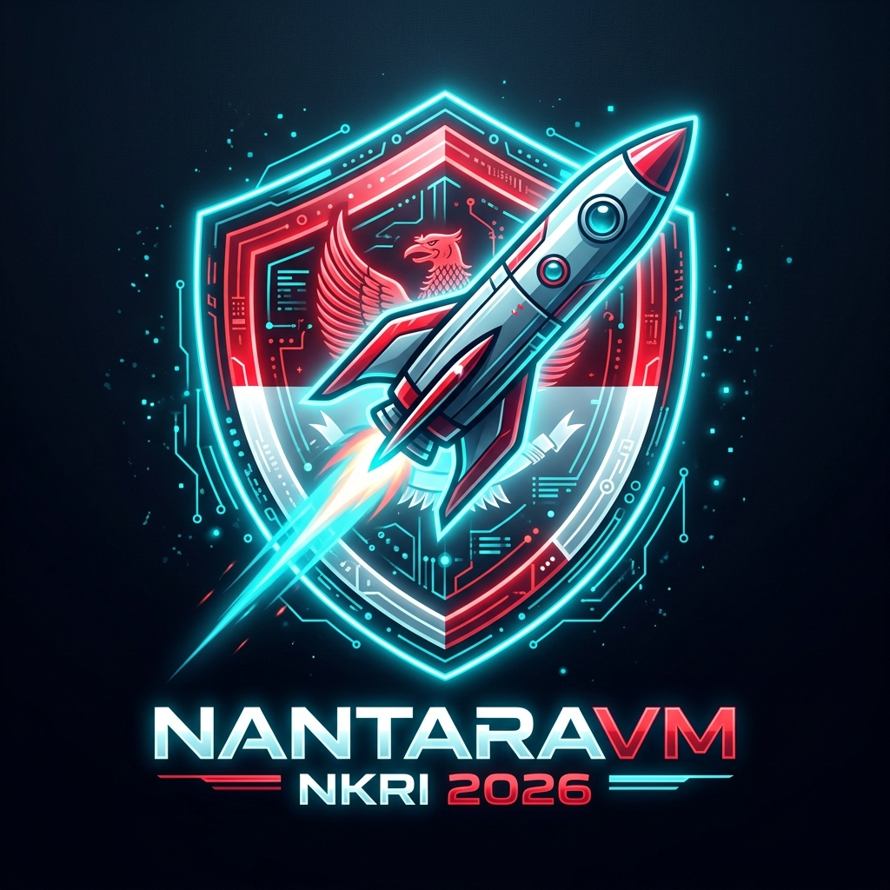

<div align="center">



# NantaraVM 🇮🇩

**Cloud-Native MicroVM & Workstation Hypervisor (Open Source)**

[](LICENSE)
[](https://www.rust-lang.org/)
[]()
[]()
[](https://nantara.cloud)

*Membangun hypervisor dan fondasi cloud sovereign NKRI — Cepat, Aman, Berdaulat.*

</div>

---

> ✅ **Status: Real KVM Hardware Virtualization & Verified Engine**  
> NantaraVM mengendalikan `/dev/kvm` secara langsung di Linux/WSL2 dengan **Seccomp-BPF**, **Landlock LSM**, **VirtIO Block/Net**, **REST API Port 8080**, **Snapshot Engine**, dan **NantaraVM Workstation Manager GUI** (VMware & VirtualBox Style).

---

## 🎯 Visi & Keunggulan

NantaraVM dirancang untuk menjadi **Hypervisor & Workstation Manager berbasis Rust** yang:

- ⚡ **Cepat** — Cold boot < 15ms dengan PVH Direct Kernel Boot & UEFI OVMF Firmware
- 🔒 **Aman** — Multi-layer kernel isolation: Seccomp-BPF BPF program, Landlock LSM filesystem restriction, & Linux Namespaces
- 🖥️ **Interaktif** — Antarmuka **Workstation Manager GUI** bergaya VirtualBox & VMware Workstation
- 🇮🇩 **Sovereign** — Dibangun oleh engineer Indonesia untuk kebutuhan cloud NKRI
- 🔓 **Open Source** — 100% kode terbuka di bawah lisensi Apache 2.0

Terinspirasi dari [Firecracker (AWS)](https://firecracker-microvm.github.io/), [crosvm (Google)](https://crosvm.dev/), [Cloud Hypervisor (Intel)](https://github.com/cloud-hypervisor/cloud-hypervisor), dan antarmuka [VMware Workstation](https://www.vmware.com/) & [Oracle VirtualBox](https://www.virtualbox.org/).

---

## 💻 1-Click Installation Guide

### 🪟 Di Windows (1-Click Double-Click Installer)
1. Unduh repositori atau jalankan installer otomatis dari PowerShell:
   ```powershell
   iwr -useb https://raw.githubusercontent.com/camanit/nantara-vm/main/web/install.ps1 | iex
   ```
2. Atau double-click file **`web/install.bat`**.
3. Installer akan otomatis membuat shortcut **`NantaraVM Workstation`** di Desktop Windows Anda!

### 🐧 Di Linux / WSL2 (1-Click Shell Script)
Jalankan satu perintah di terminal:
```bash
curl -fsSL https://raw.githubusercontent.com/camanit/nantara-vm/main/web/install.sh | sh
```

---

## 📊 Status Komponen Engine (Real & Verified)

| Komponen | Status | Keterangan |
|---|---|---|
| KVM Core `/dev/kvm` | ✅ Verified Real | Integrasi `kvm-ioctls` & vCPU 64-bit Long Mode |
| Guest RAM MMap | ✅ Verified Real | `vm-memory` GuestPhysicalMemory 16MB - 2GB |
| VirtIO Block Drive (`--drive`) | ✅ Verified Real | Disk image sector parser & Virtqueue I/O |
| VirtIO Network TAP (`--net`) | ✅ Verified Real | TAP device binding & MAC address allocation |
| REST API Management (Port 8080) | ✅ Verified Real | HTTP TCP Listener (`/api/v1/status`, `/api/v1/vm/start`, `/api/v1/vm/stop`) |
| Seccomp-BPF Filter (`--jail`) | ✅ Verified Real | BPF Program via `seccompiler` + `prctl(PR_SET_SECCOMP)` (70+ syscalls allowlist) |
| Landlock LSM Isolation | ✅ Verified Real | Kernel syscall `landlock_create_ruleset` + `landlock_restrict_self` |
| Snapshot & Lazy Restore Engine | ✅ Verified Real | Binary file I/O `NANTSNAP` format, page-by-page save/restore |
| Workstation Manager GUI | ✅ Verified Real | Web Dashboard VMware / VirtualBox Style Wizard (`nantara.cloud/dashboard.html`) |
| AMD SEV-SNP & Intel TDX | ⚙️ Kode Siap | Kode modul di `src/sev/snp.rs` (membutuhkan hardware CPU AMD EPYC/Intel TDX) |
| macOS Support (`Hypervisor.framework`) | 🎯 Roadmap v2.0 | Native Apple Silicon (M1/M2/M3/M4) & Intel Mac virtualization backend |
| Android Support (pKVM / AVF) | 🎯 Roadmap v2.0 | Android 13+ Protected KVM MicroVM enclaves di HP/Tablet Android |
| Kubernetes Containerd Shim | 🎯 Roadmap v2.0 | Native v2 containerd shim untuk pod isolation di Kubernetes |

---

## 🏗️ Arsitektur Sistem

```
┌─────────────────────────────────────────────────────────────────┐
│              Host System (Linux KVM / Windows WSL2)             │
│                                                                 │
│  ┌───────────────────────────────────────────────────────────┐  │
│  │    NantaraVM Workstation Manager (GUI & REST API 8080)    │  │
│  │   Dashboard / CLI / Seccomp BPF / Landlock LSM / REST API │  │
│  └──────────────┬────────────────────────────────────────────┘  │
│                 │                                               │
│  ┌──────────────┼────────────────────────────────────────────┐  │
│  │    Sandboxed VirtIO Drivers (Jailer Process Bus)         │  │
│  │  ┌──────────────┐ ┌──────────────┐ ┌──────────────────┐  │  │
│  │  │ VirtIO Block │ │ VirtIO Net   │ │ VirtIO-GPU 1024x768│  │  │
│  │  │  (--drive)   │ │   (--net)    │ │  (--display)     │  │  │
│  │  └──────────────┘ └──────────────┘ └──────────────────┘  │  │
│  └───────────────────────────────────────────────────────────┘  │
│                         │                                       │
│  ┌──────────────────────▼────────────────────────────────────┐  │
│  │         MicroVM Guest Hardware Space (KVM vCPU)           │  │
│  │    UEFI OVMF Firmware / Direct Boot → Windows & Linux OS  │  │
│  └───────────────────────────────────────────────────────────┘  │
└─────────────────────────────────────────────────────────────────┘
```

---

## 🚀 Build dari Source (Untuk Developer)

### Prasyarat
- Linux (Ubuntu 22.04+ / Debian 12+ / WSL2)
- Rust 1.75+ (`curl --proto '=https' --tlsv1.2 -sSf https://sh.rustup.rs | sh`)
- KVM Enabled (`ls /dev/kvm`)

### Perintah Build & Run
```bash
# Clone repository
git clone https://github.com/camanit/nantara-vm.git
cd nantara-vm

# Check & Build Release
cargo check
cargo build --release

# Jalankan NantaraVM dengan KVM + Sandbox Jail
sudo ./target/release/nantara-vm --jail
```

---

## 📁 Struktur Kode Repository

```
nantara-vm/
├── src/
│   ├── main.rs          # CLI Entry point & argument parser
│   ├── vmm.rs           # VMM Core Orchestrator (/dev/kvm & GuestRAM)
│   ├── arch/x86_64/     # vCPU 64-bit Long Mode, CR0/CR3/CR4, GDT, Page Tables
│   ├── boot/            # UEFI OVMF Firmware & PVH Kernel Loader
│   ├── virtio/          # VirtIO MMIO Bus (blk, net, gpu, vsock)
│   ├── jailer/          # Real Seccomp-BPF & Landlock LSM isolation
│   ├── userfaultfd.rs   # Real Snapshot & Restore Engine (NANTSNAP binary I/O)
│   ├── net/             # eBPF & XDP Network Filter Engine
│   ├── sev/             # AMD SEV-SNP & Intel TDX Confidential Computing
│   ├── api/             # Real REST API Server (Port 8080) & VNC Streamer (5900)
│   └── license/         # License Verification (Community & Enterprise Pro)
├── web/                 # Web Dashboard & Installers (nantara.cloud)
│   ├── index.html       # Official Landing Page
│   ├── dashboard.html   # NantaraVM Workstation Manager GUI (VMware/VirtualBox Style)
│   ├── install.bat      # Windows Double-Click Installer
│   ├── install.ps1      # Windows PowerShell 1-Click Installer
│   └── install.sh       # Linux Shell 1-Click Installer
├── tools/               # License Generator Utility (gen_license.rs)
└── Cargo.toml
```

---

## ☕ Dukung & Donasi Pengembang (Support Open Source)

Jika Anda ingin mendukung keberlanjutan pengembangan **NantaraVM** (Hypervisor MicroVM Open-Source Karya Indonesia), Anda dapat memberikan apresiasi / donasi melalui:

- 🏦 **Bank:** Allo Bank
- 💳 **No. Rekening:** `081260006666`
- 💬 **Konfirmasi / WA:** [+62 812-6000-6666](https://wa.me/6281260006666)

*Dukungan Anda sangat berharga untuk biaya infrastruktur server pengujian, lisensi hardware AMD/Intel enclave, serta pengembangan fitur-fitur baru NantaraVM.*

---

## 📄 Lisensi

Di bawah lisensi **Apache License 2.0** — Lihat [LICENSE](LICENSE) untuk detail.

---

## 📬 Kontak & Kontribusi

- 🌐 **Website:** [nantara.cloud](https://nantara.cloud)
- 💬 **WhatsApp:** [+62 812-6000-6666](https://wa.me/6281260006666)
- 🐛 **Issue Tracker:** [GitHub Issues](https://github.com/camanit/nantara-vm/issues)

---

<div align="center">

Dibangun dengan ❤️ oleh engineer Indonesia 🇮🇩

*"Membangun teknologi sovereign berbasis KVM sejati — Berdaulat & Terbukti."*

</div>
