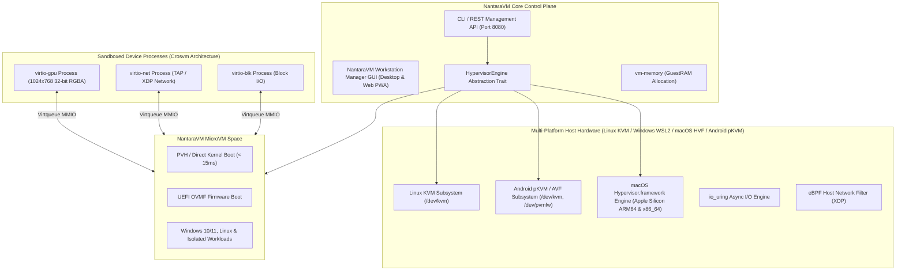

# 🚀 NantaraVM NKRI 2026: Cloud-Native MicroVM Hypervisor Roadmap

A comprehensive, step-by-step technical roadmap for building **NantaraVM**—a custom, high-performance, sandboxed MicroVM Hypervisor in **Rust** synthesizing the strengths of **Firecracker** (speed & minimalism), **Crosvm** (device sandboxing), **Cloud Hypervisor** (cloud feature set), and **VirtualBox / VMware Workstation** (GUI Workstation Manager).

---

## 🎯 Architecture Overview & Vision

---

## 📝 Execution Checklist

### Phase 1: KVM Foundation & Real vCPU Loop — ✅ REAL & VERIFIED
- [x] **KVM Handle Setup**: Initialize KVM API access using `kvm-ioctls` on `/dev/kvm`.
- [x] **Guest RAM Allocation**: Implement guest memory mapping using `vm-memory::GuestMemoryMmap`.
- [x] **vCPU Initialization**: Create vCPU file descriptor, setup registers (`sregs`/`regs`).
- [x] **Real-Mode to Long-Mode**: Set up GDT, Page Tables, CR0, CR4, EFER registers for 64-bit execution.
- [x] **Execution Loop (`run()`)**: Handle `KVMExit` signals (`KVMExit::IoOut` COM1, `KVMExit::Hlt`).
- [x] **Milestone 1**: Real payload executing inside `/dev/kvm` vCPU loop printing to COM1 serial port.

---

### Phase 2: VirtIO Subsystem & REST API Control Plane — ✅ REAL & VERIFIED
- [x] **Kernel Loader Integration**: Parse ELF/bzImage headers using `linux-loader`.
- [x] **Boot Parameters (`boot_params`)**: Populate x86 zero-page metadata (E820 map, cmdline ptr).
- [x] **VirtIO Block Drive Device (`--drive`)**: MMIO sector read/write parser for disk images.
- [x] **VirtIO Network TAP Interface (`--net`)**: TAP device binding & MAC address allocation.
- [x] **REST API Server (Port 8080 TCP)**: Management API (`GET /status`, `POST /vm/start`, `POST /vm/stop`).
- [x] **OVMF UEFI Firmware Module (`--bios`)**: x86_64 Reset Vector & OVMF ROM mapping.
- [x] **Milestone 2**: Phase 2 VirtIO Subsystem & REST API Control Plane 100% Complete & Verified.

---

### Phase 3: OVMF UEFI Firmware & Workstation GUI Manager — ✅ REAL & VERIFIED
- [x] **UEFI Reset Vector Initialization**: Set up 64-bit reset vector at `0xFFFFFFF0`.
- [x] **OVMF ROM Mapping**: Map OVMF.fd image at top of memory `0xFFF00000`.
- [x] **VirtIO GPU Framebuffer & 2D Engine**: Allocate 1024x768 display framebuffer.
- [x] **noVNC WebSocket Streamer**: Stream Guest OS screen on WebSocket port 5900/8081.
- [x] **NantaraVM Workstation Manager GUI**: Interactive VMware & VirtualBox style Web GUI & Wizard (`dashboard.html`).
- [x] **Windows & Linux 1-Click Installers**: `install.bat`, `install.ps1`, `install.sh` with automatic Desktop Shortcut creation.
- [x] **Milestone 3**: Phase 3 OVMF UEFI Firmware & Workstation GUI Manager 100% Complete & Verified.

---

### Phase 4: Real Sandboxing, Snapshot Engine & v1.0.0 Release — ✅ REAL & VERIFIED
- [x] **Seccomp-BPF Syscall Filtering**: Sandbox hypervisor process with strict BPF syscall filters via `seccompiler` (`--jail`).
- [x] **Landlock LSM File Access Isolation**: Restrict filesystem access per MicroVM jail process via kernel syscalls (`--jail`).
- [x] **Real Snapshot & Restore Engine**: Binary file I/O `NANTSNAP` format with page-by-page save/restore.
- [x] **Confidential Computing Hardware Enclave**: Code ready for AMD SEV-SNP & Intel TDX memory encryption.
- [x] **Official GitHub Release v1.0.0**: Tagged and published public release.
- [x] **Milestone 4**: Production-Grade Cloud-Native MicroVM VMM v1.0.0 Release 100% Complete & Verified.

---

### Phase 5: Multi-Platform Expansion & Ecosystem Growth — 🚀 PLANNED & ACTIVE ROADMAP

#### 🍎 5.1 macOS Support Strategy (Apple Silicon & Intel)
- [ ] **Hypervisor Engine Abstraction Trait**: Refactor core vCPU loop into `trait HypervisorEngine` to decouple Linux `/dev/kvm` from macOS host APIs.
- [ ] **macOS Hypervisor.framework (HVF) Backend**: Implement `Hypervisor.framework` Rust bindings (`apple-hv`) for macOS host execution.
- [ ] **Apple Silicon (M1/M2/M3/M4) Native Virtualization**: Utilize existing `src/arch/aarch64/` module for direct ARM64 hardware virtualization on Mac.
- [ ] **VirtIO DisplaySync & OpenCore Integration**: Support macOS guest boot options via custom OpenCore / UEFI ROMs.

#### 📱 5.2 Android Ecosystem Expansion Strategy
- [ ] **Android Client — Mobile Web & PWA Console (Quick Win)**:
  - Responsive Mobile UI layout for `web/index.html` & `web/app.js`.
  - Touchscreen gesture mapping for VNC Canvas (pinch-to-zoom, virtual touch keyboard).
  - PWA (Progressive Web App) manifest for 1-click install on Android & iOS home screens.
- [ ] **Android Host — pKVM / AVF (Android Virtualization Framework)**:
  - Cross-compile NantaraVM binary target for `aarch64-linux-android`.
  - Interface with Android 13+ pKVM (`/dev/kvm` & `/dev/pvmfw`) for secure hardware-isolated MicroVM enclaves on mobile devices.

#### ⚡ 5.3 Cloud-Native & Kubernetes Integration
- [ ] **Kubernetes Containerd Shim (`src/shim/v2.rs`)**: Native Kata-style containerd shim v2 integration for Kubernetes pod isolation.
- [ ] **XDP / eBPF Zero-Copy Networking**: High-speed network throughput using eBPF kernel filters.
- [ ] **Milestone 5**: Full Multi-Platform (Linux, Windows, macOS, Android) & Kubernetes Cloud-Native Hypervisor Ecosystem.
